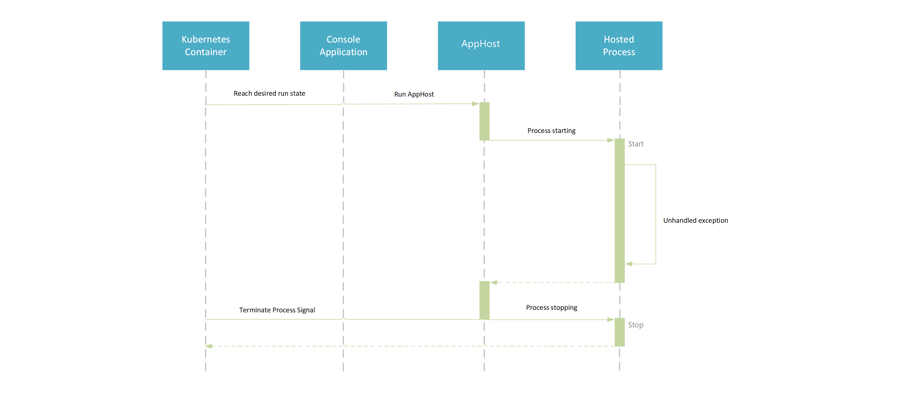
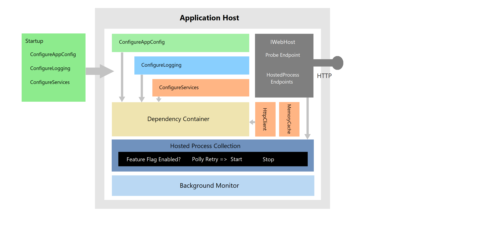
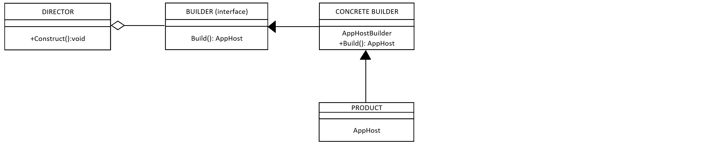

# **Cloud.Core.AppHost** [](https://dev.azure.com/cloudcoreproject/CloudCore/_build/latest?definitionId=7)  [](https://dev.azure.com/cloudcoreproject/CloudCore/_packaging?_a=package&feed=8949198b-5c74-42af-9d30-e8c462acada6&package=dbfd6121-7f3d-451e-ae14-7fa76967892f&preferRelease=true)


<div id="description">

Common functionality for hosting process execution in a standard way on Windows or Linux as an app or service (as well as within a container).

This package contains classes to host implementing interfaces to catch unhandled exception handling and carry out various self-healing 
configuration, like rerunning failed processes. 

Handles the SIGTERM command to shut down on multiple operating systems.

The sequence of flow is shown in the example below.  This is a console application, hosted within a Kubernetes node.  We can see that 
if the node sends a termination signal, the application will have an opportunity to gracefully shut down.

</div>



The general mechanics of the AppHost are covered in the diagram below:



## Design
There are two main design patterns used when constructing an AppHost instance.  They are:

1. Builder pattern
2. Fluent interface

The builder method is a way in which class constuction is simplied using an object "builder", the fluent interface is the manner in which various properties and 
configurations are set on the builder itself.  As with any builder, the build is finalised with the "Build" method, which gives an instance of the desired class.

Our AppHostBuilder creates an instance of AppHost in the following way:



For more information on these patterns, the following articles are useful reads:

- *Builder* - https://www.codeguru.com/columns/dotnet/.net-design-patterns-the-builder-pattern.html

- *Fluent interface* - https://stackoverflow.com/questions/10046629/conditional-builder-method-chaining-fluent-interface

### Other Patterns used
There are a number of other notable patterns used within the AppHost, such as Service Locator, Singleton and Dependency Injection.  

- *Service Locator* - http://www.stefanoricciardi.com/2009/09/25/service-locator-pattern-in-csharpa-simple-example/

- *Singleton* - https://www.c-sharpcorner.com/UploadFile/8911c4/singleton-design-pattern-in-C-Sharp/

- *Dependency Injection* - https://www.dotnettricks.com/learn/dependencyinjection/implementation-of-dependency-injection-pattern-in-csharp


## Usage
### Building an AppHost using AppHostBuilder

The example below shows the bare minimum you need to have to build an AppHost and run an IHostedProcess class.

```csharp
public class Program
{
   public static void Main(string[] args)
   {
      try
      { 
         var host = new AppHostBuilder()
                    .AddHostedProcess<MySampleProcess>()
                    .Build();
         host.RunOnce();
      }
      catch (Exception e)
      {
         Console.WriteLine("Problem during startup:");
         Console.WriteLine(e);
      }
   }
}
```

In the example above, the builder will wire up a dependency container with one singleton instance off MySampleProcess, this is done when the AddHostedProcess
method is called.  The Build method creates an instance of AppHost, which will start and stop the IHostedProcesses which have been added (again, in this case
it will only be MySampleProcess that is started and stopped).


#### Additional features of AppHostBuilder

  **ConfigureAppConfig** - Configure your application IConfigurationRoot here.  Add config from various sources such as an AppSettings.json or Environment variables.

  **ConfigureLogging** - Configure your application logging here.  By deafult the console is added as a logger but you may have others, such as AppInsights.

  **ConfigureServices** - Configure all application wide dependencies here.  If your IHostedProcess needs any services or dependencies, make sure they are configured here.

  **CreateDefaultBuilder** - You can call this method to create a default set of configurations - MemoryCache will be added, default Polly Retry policies are added.

All of the above can be done using a Startup class - covered further in the readme.

  **AddHealthProbe** - Adds an endpoint `/probe` when the app is running, which allows the status of the running app to be gathered.  200 OK means no faults and 500 means faulted.

  **AddRetryWaitPolicy** - Adds a specific policy to the polly policies that wrap the IHostedProcess start call.

  **AddMemoryCache** - Add in memory caching as a dependency.  Enables IMemoryCache to be injected into classes.

  **AddHttpClient** - Add HttpClient singleton to the dependency container, ready to be injected into classes as a dependency.

  **UseDefaultRetryPolicies** - Rather than adding your own retry policies, this will add a default set of policies, such as SocketException/TimeoutException/NetExcetpion 
  which wrap the HostedProcess start method call and will retry if any of these exceptions occur during start.

  **UseHostedProcessEndpoints** - If this is enabled, all hosted processes are executable via endpoints.  The start method is executed when the endpoint is accessed.  Endpoints
  are available via GET calls and they will have the same name as the hosted process.  If you want a list of available endpoints, go to the `/swagger` url and it will list all.
 
  **UseBackgroundMonitor** - If this is enabled, a timer will run in the background and log to the console after each tick.  This is useful for keeping the app alive when running in 
  a web job (timesout after 121 seconds).

**Note:** Feature flags will be added soon, so that a hosted process only executes if a feature flag is enabled.

### Using convention-based Startup 
Although the ConfigureAppConfig/ConfigureLogging/ConfigureServices are available on the WebHostBuilder and can be called inline, as shown below:

```csharp
public class Program
{
   public static void Main(string[] args)
   {
      try
      { 
        var host = new AppHostBuilder().CreateDefaultBuilder()
            .ConfigureAppConfiguration(configBuilder => {
               configBuilder.UseKubernetesContainerConfig();
            })
            .ConfigureLogging((config, logBuilder) => {
               logBuilder.AddConsole();
            })
            .ConfigureServices((config, logger, serviceBuilder) => {
               serviceBuilder.AddSingleton<SomeService>();
            })
            .AddHostedProcess<MySampleProcess>()
            .Build();
         host.RunAndBlock();
      }
      catch (Exception e)
      {
         Console.WriteLine("Problem during startup:");
         Console.WriteLine(e);
      }
   }
}
```

Instead of configuring inline, a Startup class can also be used.  This is called Convention-based startup and is common feature of .net Core applications.  It's useful if you have
lots of complex dependencies to wire up and want to do this in one place.  Keeping the Program class just for config and without logic.  Using the example above, this is what we'd have 
instead:

```csharp
public class Program
{
   public static void Main(string[] args)
   {
      try
      { 
         var host = new AppHostBuilder().CreateDefaultBuilder()
                    .UseStartup<Startup>()
                    .AddHostedProcess<MySampleProcess>()
                    .Build();
        host.RunAndBlock();
      }
      catch (Exception e)
      {
         Console.WriteLine("Problem during startup:");
         Console.WriteLine(e);
      }
    }
}
```
Where Startup class is defined as follows:

```csharp
public class Startup
{
    public void ConfigureAppConfiguration(IConfigurationBuilder builder)
    {
	    builder.UseDefaultConfig();
    }

    public void ConfigureLogging(IConfiguration config, ILoggingBuilder builder)
    {
	    builder.AddConfiguration(config.GetSection("Logging"));
	    builder.AddConsole();
    }

    public void ConfigureServices(IConfiguration config, ILogger logger, IServiceCollection services)
    {
	    serviceBuilder.AddSingleton<SomeService>();
    }
}
```
This keeps Program/Main neat and only about config.  To utilise a Startup class (it can be called anything, but typically Startup.cs), the class needs to have the three same methods as you'd use inline - as shown in the example.

### Adding hosted processes

The interface that needs to be implemented by classes which will use the ProcessHost service is defined as follows:

```csharp
public interface IHostedProcess
{
    void Start(AppHostContext context, CancellationToken cancellationToken);
    void Stop();
    void Error(Exception ex);
}
```
An example of an implementing IHostedProcess class would be the following:

    // Example process that implements IHostedProcess.
    public class MySampleProcess : IHostedProcess
    {
        // Setup any services the main Run process may require.
        public void Start(AppHostContext context, CancellationToken token)
        {
            Console.WriteLine("Started up! Doing work...");
            Thread.Sleep(3000);
            Console.WriteLine("Work done");
        }

        // Clean up any services used, make any final calls out before closing.
        public void Stop()
        {
            Console.WriteLine("Shut down triggered!!");
        }

        // General error has occurred - captured here before shut down begins as an
        // opportunity for the caller to handle.
        public void Error(Exception ex)
        {
            Console.WriteLine($"An error happened: {ex.Message}");
        }
    }

Now this class is ready to be hosted!  Add your hosted processes to AppHostBuilder - you can add multiple hosted processes (they will be started in the order they are added).

### Starting your AppHost
When you've built an AppHost, you can start it in two modes.  RunAndBlock or RunOnce, shown below:

```csharp
// Run once and stay active - useful in multithreaded applications, such as ServiceBus apps.
processHost.RunAndBlock();
```

```csharp
// Run once then complete - useful for Jobs that run through and then stop.
processHost.RunOnce();
```

## Project Template
You can find an AI Project template that has a default implementation of AppHost here:
https://dev.azure.com/cloudcoreproject/CloudCore/_wiki/wikis/CloudCore.wiki?pagePath=%2FHome%2FCloud.Core%20Templates

## Test Coverage
A threshold will be added to this package to ensure the test coverage is above 80% for branches, functions and lines.  If it's not above the required threshold 
(threshold that will be implemented on ALL of the core repositories to gurantee a satisfactory level of testing), then the build will fail.

## Compatibility
This package has has been written in .net Standard and can be therefore be referenced from a .net Core or .net Framework application. The advantage of utilising from a .net Core application, 
is that it can be deployed and run on a number of host operating systems, such as Windows, Linux or OSX.  Unlike referencing from the a .net Framework application, which can only run on 
Windows (or Linux using Mono).
 
## Setup
This package is built using .net Standard 2.1 and requires the .net Core 3.1 SDK, it can be downloaded here: 
https://www.microsoft.com/net/download/dotnet-core/

IDE of Visual Studio or Visual Studio Code, can be downloaded here:
https://visualstudio.microsoft.com/downloads/

## How to access this package
All of the Cloud.Core.* packages are published to a internal NuGet feed.  To consume this on your local development machine, please add the following feed to your feed sources in Visual Studio:
https://pkgs.dev.azure.com/cloudcoreproject/CloudCore/_packaging/Cloud.Core/nuget/v3/index.json
 
For help setting up, follow this article: https://docs.microsoft.com/en-us/vsts/package/nuget/consume?view=vsts


